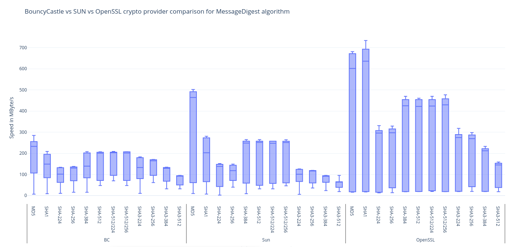

OpenSSL4J JNI Java Library
===================

[](https://github.com/sfuhrm/openssl4j/actions/workflows/build-singleplatform.yml)
[](https://github.com/sfuhrm/openssl4j/actions/workflows/build-java.yml)
[](https://github.com/sfuhrm/openssl4j/actions/workflows/build-crossplatform.yml)
[](https://maven-badges.herokuapp.com/maven-central/de.sfuhrm/openssl4j)
[](https://opensource.org/licenses/Apache-2.0)

OpenSSL4J is a Java bridge to the native OpenSSL library.
On the Java side it's offering the
conventional [MessageDigest](https://docs.oracle.com/javase/8/docs/api/java/security/MessageDigest.html) class. In the background the calls
will be translated to the native OpenSSL library with all its
[optimizations](https://www.openssl.org/docs/faq-4-build.txt):

> On x86, the assembly code uses the CPUID instruction (see the
> OPENSSL_ia32cap.pod manpage) to determine if various instructions (AES,
> SSE, MMX, etc) are available and will use them if so.  For other processors,
> similar tests are performed if at all possible.

## Features

* Performance: The main feature of OpenSSL4J is performance: The MD5-implementation of OpenSSL4J is
typically 67% to 102% faster than the pure Java version from SUN.
* Functionality: There are some algorithms available in OpenSSL4J that are not available in the normal SUN crypto provider.

## Performance

The following picture shows a performance comparison of

* BouncyCastle crypto provider (version 1.70)
* Adoptium JDK SUN crypto provider (JDK 17.0.6)
* OpenSSL4j (version 0.3.0)

Each bar shows different throughputs in megabytes per second.
The per-bar throughputs contain multiple different test scenarios
regarding blocks sizes and data structures used for
data passing (byte, array, direct ByteBuffer, heap ByteBuffer).
The median of the tests is presented by a dark-blue horizontal line
within the bar. The 25% and 75% quantile make up the
area of the bars.



The benchmark was conducted on a i7-3840QM CPU.

## Building OpenSSL4J for your platform

For building the application you need

* JDK 8+,
* Apache Maven,
* GNU Make,
* GNU GCC,
* OpenSSL development headers

To build the C library for your current platform, wrap it into a maven artifact (openssl4j-objects), build the java parts (openssl4j), execute:

```bash
$ build.sh
...
[INFO] Reactor Summary for OpenSSL4J Parent 0.2.1-SNAPSHOT:
[INFO] 
[INFO] OpenSSL4J Parent ................................... SUCCESS [  0.953 s]
[INFO] OpenSSL4J JNI ...................................... SUCCESS [  5.859 s]
[INFO] ------------------------------------------------------------------------
[INFO] BUILD SUCCESS
[INFO] ------------------------------------------------------------------------
[INFO] Total time:  6.912 s
[INFO] Finished at: 2023-05-28T20:38:43+02:00
[INFO] ------------------------------------------------------------------------    
```

## Building OpenSSL4J for cross-platform

The current cross-platform build is driven by github actions, using QEMU
to build different platform shared object library.
The github actions are visible to everyone.
For the cross-platform build to work with your fork, there
are some project secrets needed to be set in your
Github fork settings:

* DOCKERHUB_USERNAME: Dockerhub username for getting the parent of the build image.
* DOCKERHUB_TOKEN: Dockerhub secret token.
* GH_USER: Github username for storing artifacts.
* GH_PASSWORD: Github password for storing artifacts.
* SONATYPE_USER: (optional) sonatype username for pushing snapshots.
* SONATYPE_PASSWORD: (optional) sonatype password for pushing snapshots.

(Date of last update: 2023-05-28)

## Restrictions

* MessageDigest restriction: The current milestone only contains MessageDigest algorithms.
* Restricted platforms: The code uses dynamic linking to an object library on the machine.
  Native object code within the JAR file is used for binding the Java code to the native code.
  There is a restricted amount of platforms supported by the Github Actions
  builder (see below).

## Usage

### Dynamic security provider configuration

The following example show how to create a MD5 message digest instance with the
dynamically chosen security Provider:

---------------------------------------

```java
import de.sfuhrm.openssl4j.OpenSSL4JProvider;

...

MessageDigest messageDigest = MessageDigest.getInstance("MD5", new OpenSSL4JProvider());
messageDigest.update("hello world!".getBytes(Charset.forName("ASCII")));
byte[] digest = messageDigest.digest();
```

---------------------------------------

### Installing it in the JDK

You can also install the provider in your JDK installation. Open the `java.security` file in an editor:

* Linux, or macOS: `<java-home>/conf/security/java.security`
* Windows: `<java-home>\conf\security\java.security`

To be used effectively, insert it in front of the SUN provider. If this is how the original file looks:

---------------------------------------

```
security.provider.1=SUN
security.provider.2=SunRsaSign
security.provider.3=SunEC
security.provider.4=SunJSSE
security.provider.5=SunJCE
security.provider.6=SunJGSS
security.provider.7=SunSASL
security.provider.8=XMLDSig
security.provider.9=SunPCSC
...
```

---------------------------------------

then the new file could look like this after inserting and renumbering the entries:

---------------------------------------

```
security.provider.1=OpenSSL4J
security.provider.2=SUN
security.provider.3=SunRsaSign
security.provider.4=SunEC
security.provider.5=SunJSSE
security.provider.6=SunJCE
security.provider.7=SunJGSS
security.provider.8=SunSASL
security.provider.9=XMLDSig
security.provider.10=SunPCSC
...
```

---------------------------------------

## Including it with Maven

The recommended way of including the library into your project is using maven:

---------------------------------------

```xml
<dependency>
    <groupId>de.sfuhrm</groupId>
    <artifactId>openssl4j</artifactId>
    <version>0.4.2</version>
</dependency>
```

---------------------------------------

## Native platforms supported

There are the following native implementations available inside the JAR file:

* Linux-aarch64
* Linux-amd64
* Linux-arm
* Linux-ppc64le
* Linux-s390x

## Version notice

Please note that the current version is experimental.

## Versions

The version numbers used by `openssl4j` itself comply to the
[semantic versioning](https://semver.org/) schema.
Especially major version changes come with breaking API
changes.

The temporary internal `openssl4j-objects` artifact is using
date-derived versions, but it is invisible to maven users.

## Author

Written 2020-2023 by Stephan Fuhrmann. You can reach me via email to s (at) sfuhrm.de

## License

The project *is* licensed under [Apache License 2.0](https://www.apache.org/licenses/LICENSE-2.0.txt) after excluding OpenSSL4j release v0.3.0.

The project *was* licensed under [LGPL 3.0](https://www.gnu.org/licenses/lgpl-3.0.en.html) until including OpenSSL4j release v0.3.0.
